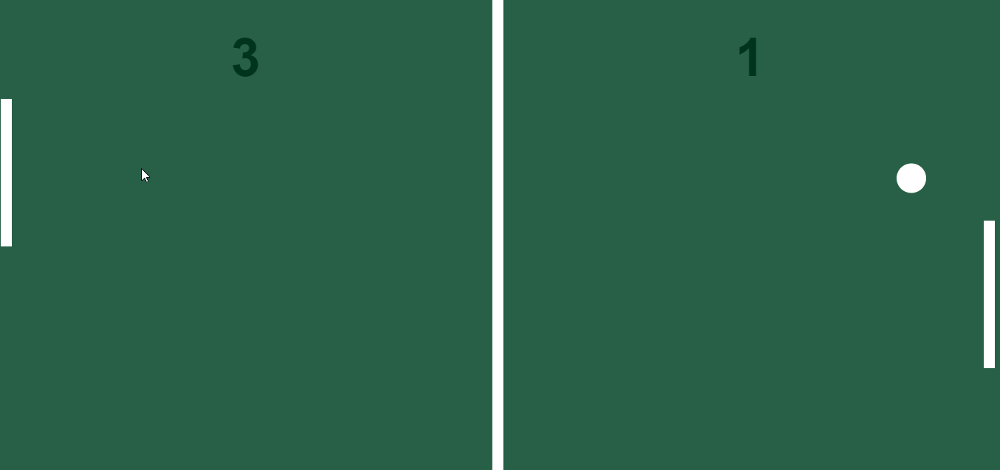

# PING-PONG| 

## Seja Bem-vindo(a) !!

Obrigado por visitar meu perfil! :0 

###  🚀 Projeto PING-PONG  🚀
 

O projeto PING-PONG tem como proposta desenvolver e aguçar as habilidades de lógica de programação.  Desenvolver jogos de alta ou baixa complexidade é uma exelente forma de melhorarmos nossa programação como um todo, porque é visualmente facil entender como as coisas funcionam. 

  

  

### Habilidades utilizadas 💻👨🏻‍💻🖥

 
  <ul>
    <li> HTML  </li>
   <li> CSS &nbsp;&nbsp; </li>
    </ul>

 

 &nbsp;&nbsp;&nbsp;&nbsp; 

###  Processo de desenvolvimento ⌨️🖱

Iniciei criando os desenhos do campo, linha central, raquetes, bolinha e placar, fazendo Apos ter uma estrutura basica montada, dei inicio ao processo de criação de objeto  programação orientada objeto